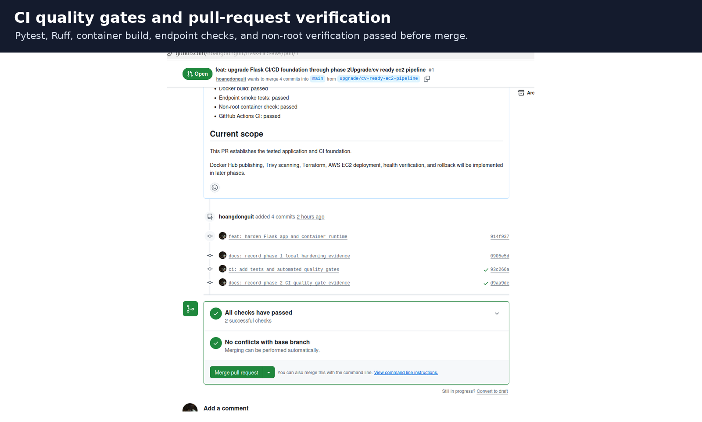
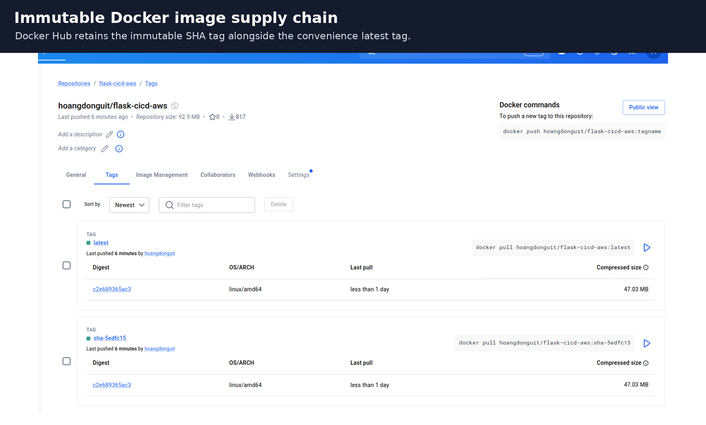
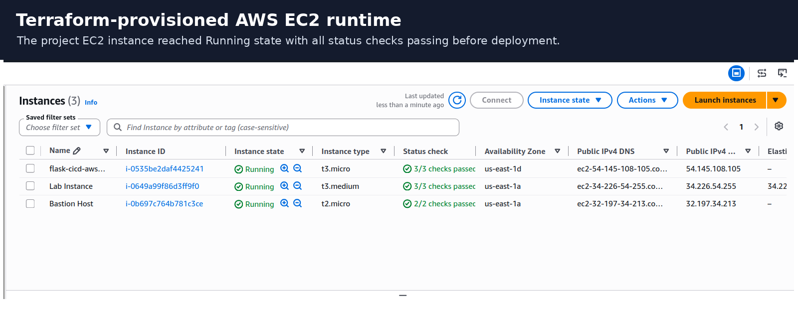
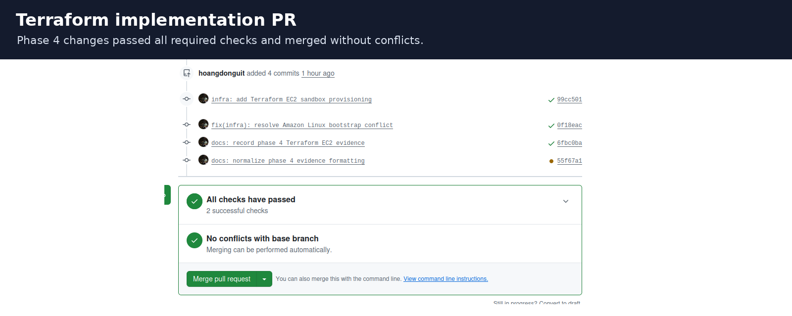
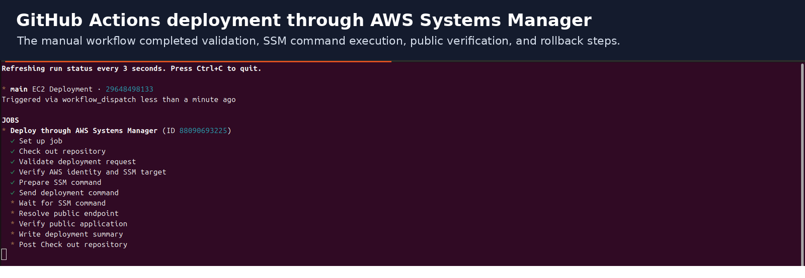

# Portfolio Screenshots

These screenshots summarize the verified delivery lifecycle of
`flask-cicd-aws`.

## 1. CI quality gates

Automated testing, linting, container verification, and non-root checks gate
pull requests before merge.

## 2. Immutable image tags

The image supply-chain workflow publishes immutable `sha-<short-sha>` tags and
keeps `latest` only as a convenience tag.

## 3. Terraform-provisioned EC2 runtime

Terraform provisioned the AWS EC2 runtime and project Security Group in the
AWS Academy Sandbox.

## 4. Terraform pull-request verification

The infrastructure implementation passed repository checks and merged without
base-branch conflicts.

## 5. AWS Systems Manager deployment and rollback

GitHub Actions executed the production deployment and rollback through AWS
Systems Manager, preserving the restricted SSH administration path.
